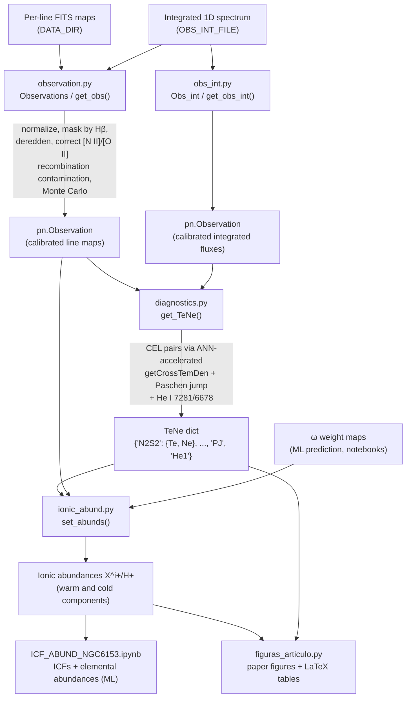

# Pipeline overview

[← Back to index](index.md)

## Scientific context

NGC 6153 is a planetary nebula with one of the best-studied **abundance
discrepancies**: abundances derived from faint heavy-element *recombination lines*
(RLs) are much larger than those from the bright *collisionally excited lines* (CELs).
The working model of the paper is that the nebula contains two gas phases:

- a **warm** component (~8000 K) emitting the CELs and most of the H I emission;
- a **cold**, hydrogen-poor component (~2000 K) emitting most of the heavy-element
  RLs.

The pipeline measures, pixel by pixel over the 200×200 MUSE field, the physical
conditions and ionic abundances of both components, and quantifies how the Hβ flux is
shared between them through the weight map **ω** (fraction of Hβ emitted by the cold
gas).

## Data flow

## Processing steps

1. **`observation.py`** — builds a PyNeb `Observation` from the per-line MUSE maps:
   flux normalization, masking of faint spaxels (Hβ cut), definition of line blends,
   optional Monte Carlo replication for error propagation, extinction correction
   from several H I line ratios, and subtraction of the recombination contribution
   to the [N II] 5755 and [O II] 7320/7330 auroral lines.
   `obs_int.py` applies the same chain to the integrated spectrum.

2. **`diagnostics.py`** — derives Te/Ne maps from:
   - pairs of CEL ratios ([N II]/[S II], [S III]/[Cl III], [Ar III], [Ar IV], ...)
     solved simultaneously with PyNeb's `getCrossTemDen`. Because this inversion is
     expensive on 40 000 pixels (× Monte Carlo), it is emulated by artificial neural
     networks ([ai4neb](https://github.com/VGomezLlanos/AI4neb)); trained networks
     are cached in `new_ai4neb/`;
   - the **Paschen jump** of the H I continuum (temperature of the recombining gas);
   - the **He I 7281/6678** ratio (Méndez-Delgado et al. 2021).

3. **`ionic_abund.py`** — converts line intensities into ionic abundances with
   PyNeb's `getIonAbundance`, choosing the Te/Ne zone from the ionization potential
   of each ion and (optionally) weighting Hβ with ω/1−ω so RL abundances refer to
   the cold component and CEL abundances to the warm one.

4. **Notebooks** — `ICF_ABUND_NGC6153.ipynb` trains/applies machine-learning models
   (including the ω prediction) and computes ICFs and total elemental abundances.
   See [Notebooks](notebooks.md).

5. **`figuras_articulo.py`** — regenerates every figure (`module/paper_figures/`)
   and LaTeX table (`module/paper_tables/`) of the paper. See
   [its API page](api/figuras_articulo.md).

## Conventions worth knowing

- **Line labels** follow PyNeb: `O3_5007A` is a CEL, a trailing `r` on the atom
  (`O2r_4649.13A`) marks a recombination line, a trailing `+` (`O2_7330A+`) a blend.
- **Maps are stored flat**: a line intensity is a 1D array of 40 000 values
  (200×200), or 200×200×(N_MC+1) when Monte Carlo realizations are present.
  Element **[0] holds the integrated-spectrum value** injected by
  `Observations.norm_obs_IFU`.
- **`TeNe` dictionaries** are keyed by diagnostic (`'N2S2'`, `'S3Cl3'`, `'PJ'`,
  `'He1'`, ...), each entry holding `'Te'` and (for CEL pairs) `'Ne'` arrays.
